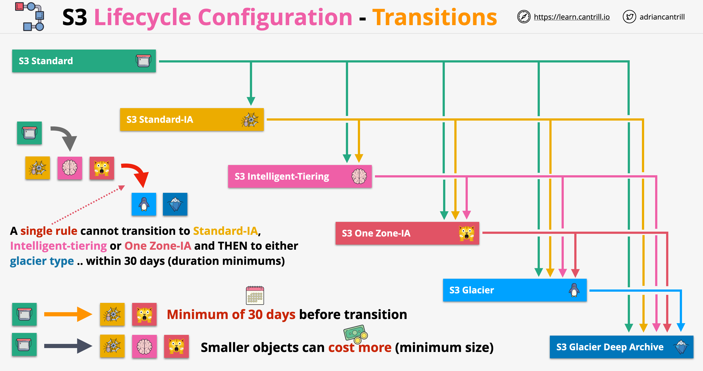
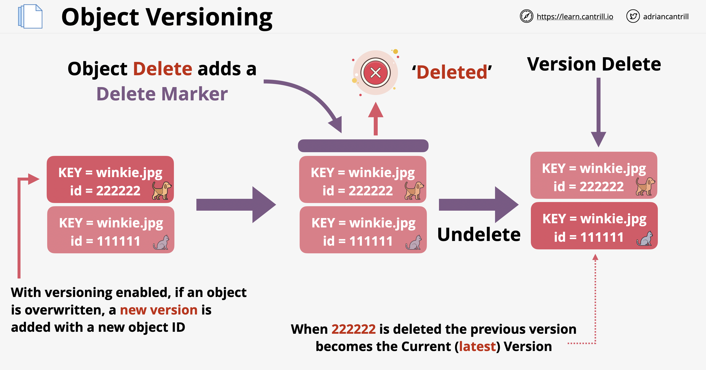

# Amazon S3

## Table of Contents

1. [S3 Lifecycle Configuration - Transitions](#transitions)
2. [S3 Storage Classes - S3 Standard](#s3-standard)
3. [S3 Storage Classes - S3 Standard-IA](#s3-standard-ia)
4. [S3 Intelligent-Tiering](#s3-intelligent-tiering)
5. [S3 Storage Classes - S3 One Zone-IA](#s3-one-zone-ia)
6. [S3 Storage Classes - S3 Glacier](#s3-glacier)
7. [S3 Storage Classes - Glacier Deep Archive](#glacier-deep-archive)
8. [Object Versioning](#object-versioning)
9. [S3 Replication](#s3-replication)

## S3 Lifecycle Configuration - Transitions 

## S3 Storage Classes - S3 Standard 

## S3 Storage Classes - S3 Standard-IA 

## S3 Intelligent-Tiering 

## S3 Storage Classes - S3 One Zone-IA 

## S3 Storage Classes - S3 Glacier 

## S3 Storage Classes - Glacier Deep Archive 

## Object Versioning 

## S3 Replication 

